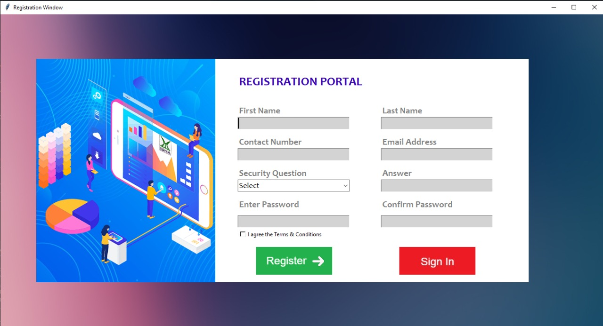

# Registration-Portal-

## Yahello...

## What is this thing ? 🙄
This is a Pythion app that can be accessed by 2 entities, namely "Administrator" and "Student". We will be using a cloud based database to access the data for this application and the GUI is made using `TKinter`.

## What all you need to run this ?
* `Python 3.9`
* `Tkinter` (a pre-installed library in Python 3.9)

## This is how u install the above mentioned libs 😤
* [Python 3.9](https://www.python.org/downloads/release/python-392/) 👈click this to install `Python`
* [Tkinter](https://tkdocs.com/tutorial/install.html) 👈this one for `Tkinter`
* [Click this for installation guide😋](https://www.youtube.com/watch?v=IDo_Gsv3KVk)

> **Note:** Installation of `Tkinter` is done along with the installaion of `Python` so go through the `Tkinter` link before you install `Python` 
 
 
 
 ## That's it 😁
 #### Now run the `Program.py` in any Text editor to view thw GUI.
 
 ## This is how it looks...
 
